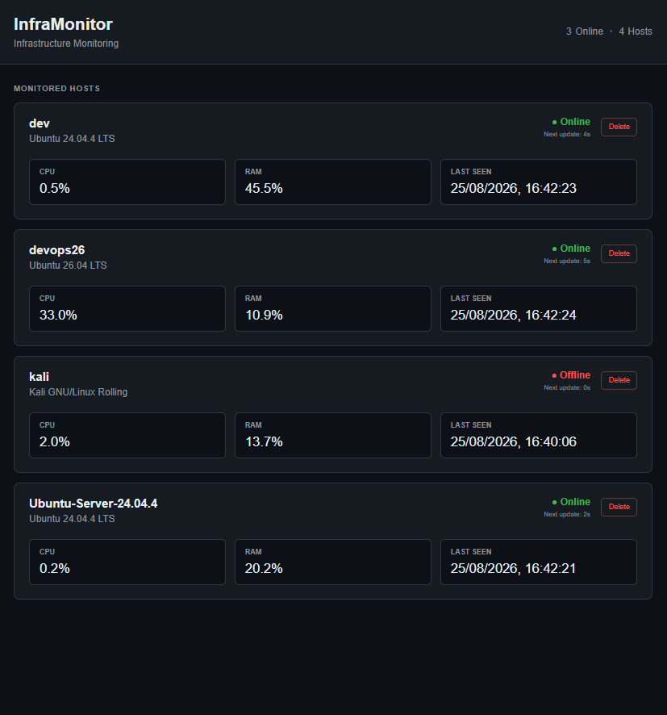
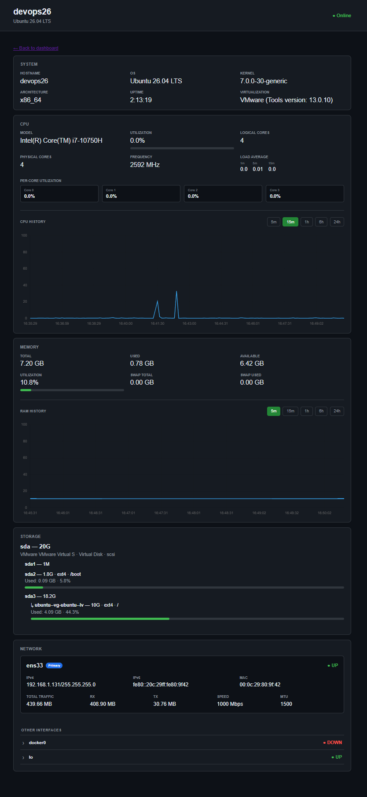

# InfraMonitor

InfraMonitor is a Linux infrastructure monitoring and inventory platform built with Python.

The InfraMonitor agent collects system, CPU, memory, storage, virtualization, and network information from Linux hosts and supports both human-readable CLI output and structured JSON.

InfraMonitor also includes a FastAPI backend, PostgreSQL database, and web dashboard for centralized host monitoring and historical report storage.

The platform supports **multi-host monitoring**: lightweight InfraMonitor agents can run on multiple Linux servers and send monitoring reports to one central backend at configurable intervals.

The project is being developed as an end-to-end DevOps platform, combining infrastructure monitoring, APIs, databases, containerization, automated testing, CI/CD, container publishing, and future infrastructure-as-code and orchestration technologies.

---

## Current Features

### System Information

- Hostname
- Linux distribution and version
- Kernel version
- System architecture
- System uptime
- Virtualization detection
- VMware Tools version detection

### CPU

- CPU model
- Physical and logical CPU information
- VM-aware vCPU reporting
- CPU frequency
- Overall CPU utilization
- Per-core utilization
- System load averages

### Memory

- Total, used, and available memory
- Memory utilization
- Swap detection and utilization
- Physical memory hardware information when available

Some physical memory hardware information requires elevated privileges and may not be exposed by virtualized environments.

### Storage

- Physical and virtual disk discovery
- Disk size, bus, vendor, model, and serial information
- HDD / SSD / virtual disk detection
- Partition discovery
- Filesystem information
- Mount points
- LVM logical volume discovery
- Filesystem utilization

### Network

- Network interface discovery
- Interface state
- Link speed when available
- MTU
- MAC address
- IPv4 and IPv6 addresses
- RX/TX traffic statistics
- Automatic traffic unit formatting

### CLI

- Human-readable system report
- Structured JSON output
- Backend report submission
- Scheduled monitoring reports
- Standard command-line help

### Backend API

- FastAPI REST API
- Monitoring report ingestion
- Host discovery and tracking
- Latest host monitoring snapshot
- Historical reports per host
- Health and database connectivity checks

### Database

- PostgreSQL persistence
- Host inventory
- Historical monitoring reports
- Host-to-report relationships
- SQLAlchemy models
- Alembic database migrations
- Automatic schema migration during backend container startup

### Web Dashboard

- Central host overview
- Individual host monitoring pages
- Latest infrastructure information
- Historical monitoring graphs

### Containerization

- Separate Agent and Backend Docker images
- Host-aware monitoring from inside the Agent container
- Read-only host filesystem access
- Host network monitoring
- Host disk, filesystem, and LVM monitoring
- Containerized FastAPI backend
- Containerized PostgreSQL
- Docker Compose deployment
- Service health checks and startup dependencies
- Automatic Agent restart
- Containerized Agent reports host information rather than container information
- Images published to GitHub Container Registry

---

## Architecture

InfraMonitor separates monitoring agents from centralized storage, API, and dashboard functionality.

Multiple Linux hosts can report to the same backend.

```text
Linux Host 1          Linux Host 2          Linux Host 3
┌─────────────┐       ┌─────────────┐       ┌─────────────┐
│ Agent       │       │ Agent       │       │ Agent       │
│ CPU / RAM   │       │ CPU / RAM   │       │ CPU / RAM   │
│ Disk / Net  │       │ Disk / Net  │       │ Disk / Net  │
└──────┬──────┘       └──────┬──────┘       └──────┬──────┘
       │                     │                     │
       └──────────────┬──────┴──────────────┬──────┘
                      │
                      │ HTTP monitoring reports
                      ▼
               ┌───────────────┐
               │ FastAPI       │
               │ Backend       │
               └───────┬───────┘
                       │
                       ▼
               ┌───────────────┐
               │ PostgreSQL    │
               │ hosts/reports │
               └───────┬───────┘
                       │
                       ▼
               ┌───────────────┐
               │ Web Dashboard │
               └───────────────┘
```

Each Agent collects information about its own Linux host and periodically sends a monitoring report to the configured Backend.

The Backend receives reports, tracks monitored hosts, stores historical snapshots in PostgreSQL, exposes REST API endpoints, and renders the monitoring dashboard.

---

## Dashboard

### Main Dashboard

The main dashboard provides a centralized view of the Linux hosts currently reporting to InfraMonitor.



### Host Details

Each monitored host has its own detailed monitoring page containing infrastructure information and historical monitoring graphs.



---

## Requirements

### Native Installation

- Linux
- Python 3.11+
- `pip`
- `venv`

### Container Deployment

- Linux
- Docker
- Docker Compose v2

InfraMonitor currently targets Linux systems.

---

## Installation

Clone the repository:

```bash
git clone https://github.com/idoCo10/InfraMonitor.git
cd InfraMonitor
```

Create a Python virtual environment:

```bash
python3 -m venv .venv
```

Activate it:

```bash
source .venv/bin/activate
```

Install InfraMonitor:

```bash
python -m pip install -e .
```

For backend and development dependencies:

```bash
python -m pip install -e ".[backend,dev]"
```

InfraMonitor is now available as a CLI command inside the virtual environment.

---

## CLI Usage

Display the system report:

```bash
inframonitor
```

Display structured JSON:

```bash
inframonitor --json
```

Send a report to a backend:

```bash
inframonitor --send http://127.0.0.1:8000
```

Send reports continuously:

```bash
inframonitor --send http://127.0.0.1:8000 --interval 5
```

The Backend URL and reporting interval can also be configured using environment variables:

```bash
export INFRAMONITOR_BACKEND_URL=http://127.0.0.1:8000
export INFRAMONITOR_INTERVAL=5

inframonitor
```

Display CLI help:

```bash
inframonitor --help
```

---

## Docker Deployment

InfraMonitor can deploy the Agent, FastAPI Backend, and PostgreSQL database through Docker Compose.

Build and start the complete stack:

```bash
docker compose up -d --build
```

Check service status:

```bash
docker compose ps
```

View logs:

```bash
docker compose logs -f
```

The local Compose environment contains:

```text
InfraMonitor Agent
        │
        │ monitoring reports
        ▼
FastAPI Backend
        │
        ▼
PostgreSQL
```

PostgreSQL is health-checked before the Backend starts.

The Backend automatically applies Alembic migrations before starting FastAPI.

The Agent waits for the Backend to become healthy before beginning report submission.

The Agent uses host-aware mounts and host networking to collect information about the underlying Linux host rather than only the container environment.

The container intentionally avoids privileged mode and unrestricted block-device access. Some low-level hardware metadata may therefore differ from native execution.

---

## Docker Images

InfraMonitor maintains separate Docker images for the Agent and Backend.

### Agent

```text
ghcr.io/idoco10/inframonitor-agent:latest
```

### Backend

```text
ghcr.io/idoco10/inframonitor-backend:latest
```

The images are automatically built and published to GitHub Container Registry after changes are merged into `main`.

Images are also tagged using the Git commit SHA so deployments can reference a specific version.

---

## Standalone Agent Deployment

Additional Linux servers do **not** need to run the complete InfraMonitor stack.

They only need the InfraMonitor Agent.

Pull the Agent image:

```bash
docker pull ghcr.io/idoco10/inframonitor-agent:latest
```

Run the Agent:

```bash
docker run -d \
  --name inframonitor-agent \
  --network host \
  --restart unless-stopped \
  -e INFRAMONITOR_HOST_ROOT=/host \
  -e INFRAMONITOR_BACKEND_URL=http://BACKEND_IP:8000 \
  -e INFRAMONITOR_INTERVAL=5 \
  -v /:/host:ro,rslave \
  -v /proc:/host/proc:ro \
  ghcr.io/idoco10/inframonitor-agent:latest
```

Replace:

```text
BACKEND_IP
```

with the IP address or hostname of the server running the InfraMonitor Backend.

For remote Agents, do not use:

```text
127.0.0.1
```

unless the Backend is running on the same host.

A multi-server deployment can therefore look like:

```text
Server 1
Agent ─────────┐

Server 2       │
Agent ─────────┼──────► Central Backend ──────► PostgreSQL
               │               │
Server 3       │               ▼
Agent ─────────┘          Web Dashboard
```

---

## Backend API

Check Backend health:

```bash
curl http://127.0.0.1:8000/health
```

Example:

```json
{
  "status": "ok",
  "database": "connected"
}
```

List monitored hosts:

```bash
curl http://127.0.0.1:8000/api/v1/hosts
```

Get a host and its latest monitoring report:

```bash
curl http://127.0.0.1:8000/api/v1/hosts/devops24
```

Get historical reports:

```bash
curl http://127.0.0.1:8000/api/v1/hosts/devops24/reports
```

---

## Development

Install InfraMonitor with Backend and development dependencies:

```bash
python -m pip install -e ".[backend,dev]"
```

Run the test suite:

```bash
python -m pytest
```

Run static analysis and linting:

```bash
ruff check .
```

The test suite covers:

- System collection
- CPU collection
- Memory collection
- Disk collection
- Network collection
- Main data collection
- CLI functionality
- Scheduled report submission
- Backend API
- PostgreSQL persistence
- Host management

---

## Database Migrations

InfraMonitor uses Alembic to manage PostgreSQL schema changes.

Check the current migration:

```bash
alembic current
```

View migration heads:

```bash
alembic heads
```

Apply migrations:

```bash
alembic upgrade head
```

When running through Docker Compose, migrations are automatically applied before the FastAPI Backend starts.

---

## CI/CD

InfraMonitor uses GitHub Actions for Continuous Integration and container publishing.

The workflow runs on:

- Pull requests targeting `main`
- Pushes to `main`

### Pull Request Pipeline

For pull requests, GitHub Actions:

1. Checks out the repository
2. Sets up Python 3.12
3. Starts PostgreSQL for integration testing
4. Installs InfraMonitor with Backend and development dependencies
5. Applies Alembic migrations
6. Runs Ruff
7. Runs the pytest test suite
8. Builds the Agent Docker image
9. Builds the Backend Docker image

The Docker images are validated but are **not published** during pull requests.

### Main Branch Pipeline

After a pull request is merged into `main`, GitHub Actions performs the validation again and publishes the Docker images to GitHub Container Registry.

```text
Pull Request
     │
     ▼
Tests + Ruff
     │
     ▼
Build Agent + Backend
     │
     ▼
Merge to main
     │
     ▼
Tests + Build
     │
     ▼
GitHub Container Registry
     │
     ├── inframonitor-agent
     │
     └── inframonitor-backend
```

Automated deployment is the next CI/CD milestone.

Workflow configuration:

```text
.github/workflows/ci.yml
```

---

## Project Structure

```text
InfraMonitor/
├── .github/
│   └── workflows/
│       └── ci.yml
│
├── agent/
│   ├── Dockerfile
│   └── inframonitor_agent/
│       ├── collectors/
│       │   ├── cpu.py
│       │   ├── disk.py
│       │   ├── memory.py
│       │   ├── network.py
│       │   └── system.py
│       ├── __init__.py
│       ├── client.py
│       ├── display.py
│       ├── host.py
│       └── main.py
│
├── backend/
│   ├── Dockerfile
│   └── inframonitor_api/
│       ├── static/
│       │   └── css/
│       │       └── dashboard.css
│       ├── templates/
│       │   ├── dashboard.html
│       │   └── host.html
│       ├── database.py
│       ├── main.py
│       └── models.py
│
├── migrations/
│   ├── versions/
│   ├── env.py
│   └── script.py.mako
│
├── tests/
│
├── Others/
│   ├── main-dashboard.png
│   └── server1.png
│
├── alembic.ini
├── compose.yaml
├── pyproject.toml
└── README.md
```

---

## Data Flow

The monitoring flow is:

```text
Agent Container
      │
      │ ENTRYPOINT ["inframonitor"]
      ▼
inframonitor_agent.main:main()
      │
      ▼
collect_all_info()
      │
      ├── System
      ├── CPU
      ├── Memory
      ├── Disk
      └── Network
      │
      ▼
Monitoring Report
      │
      ▼
send_report()
      │
      │ HTTP
      ▼
FastAPI Backend
      │
      ▼
PostgreSQL
      │
      ├── hosts
      └── reports
      │
      ▼
Web Dashboard
```

The reporting interval is configurable through:

```text
INFRAMONITOR_INTERVAL
```

---

## Roadmap

### Phase 1 — Linux Agent

- [x] System information collection
- [x] Virtualization detection
- [x] CPU inventory and utilization
- [x] Memory utilization
- [x] Disk and partition inventory
- [x] LVM discovery
- [x] Disk utilization
- [x] Network interface inventory
- [x] Network traffic statistics
- [x] Automated tests
- [x] Installable CLI
- [x] Structured JSON output

### Phase 2 — Backend & Containers

- [x] Dockerize InfraMonitor Agent
- [x] Host-aware container monitoring
- [x] FastAPI Backend
- [x] Agent-to-Backend communication
- [x] Scheduled Agent reporting
- [x] PostgreSQL persistence
- [x] Host inventory and report history
- [x] Alembic database migrations
- [x] Containerized FastAPI Backend
- [x] Multi-container Docker Compose environment
- [x] Automatic database migrations
- [x] Container health checks and startup dependencies
- [x] Web monitoring dashboard
- [x] Multi-host Agent deployment

### Phase 3 — CI/CD

- [x] GitHub Actions CI pipeline
- [x] Automated linting
- [x] Automated test execution
- [x] PostgreSQL integration testing
- [x] Database migration testing
- [x] Agent Docker image build validation
- [x] Backend Docker image build validation
- [x] GitHub Container Registry
- [x] Agent image publishing
- [x] Backend image publishing
- [ ] Automated deployment workflow

### Phase 4 — Infrastructure as Code

- [ ] Terraform
- [ ] AWS infrastructure
- [ ] Automated environment provisioning

### Phase 5 — Orchestration & Observability

- [ ] Kubernetes deployment
- [ ] Helm charts
- [ ] Prometheus integration
- [ ] Grafana dashboards
- [ ] Centralized logging

### Phase 6 — Security

- [ ] Host security checks
- [ ] Firewall status
- [ ] Listening port inventory
- [ ] SSH configuration auditing
- [ ] User and authentication auditing
- [ ] DevSecOps checks integrated into CI/CD

---

## Technology Stack

### Currently Implemented

- Python
- FastAPI
- SQLAlchemy
- PostgreSQL
- Alembic
- Jinja2
- psutil
- pytest
- Ruff
- Git
- GitHub
- GitHub Actions
- GitHub Container Registry
- Docker
- Docker Compose
- Linux system utilities

### Planned

- Terraform
- AWS
- Kubernetes
- Helm
- Prometheus
- Grafana
- Centralized logging

---

## License

MIT
